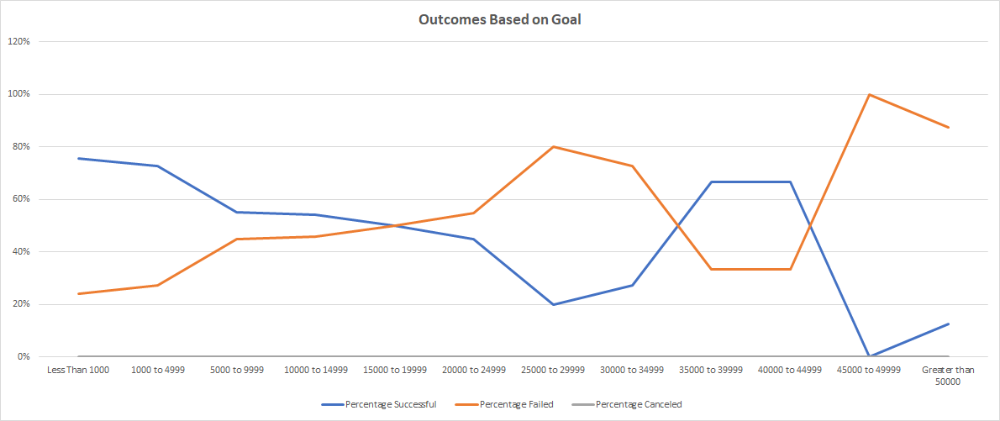

# Kickstarting with Excel

## Overview of Project
This project is all about helping an up-and-coming playwright, Loiuse, who wants to start a crowdfunding campaign to fund her new play "Fever". She estimates a budget of $10,000. She wants to know how other projects have faired in crowdfunding and wants to mirror successful projects from start to finish.
### Purpose
The purpose of the project is to help Louise make an informed decision about how to estimate her budget and plan her campaign so it is set up for success. 

## Analysis and Challenges

### Analysis of Outcomes Based on Launch Date
1. The first step is to create a readable 'Launch Date' from the 'Launched at' column by converting the Unix timestamp to a Date format using the formula =((("Launched at"/60)/60)/24)+DATE(1970,1,1).
2. Extract the year from this date using the Year() function. 
3. Create a Pivot table using the Parent Category and Year extracted from the Launch Date. The outcomes are counted and only the month is used in the rows. 
4. Create a Line Chart based off this Pivot table that shows the relationship between Outcomes and Launch month. 

### Analysis of Outcomes Based on Goals
1. The first step is to create a Dollar amount range so that the Goals can be grouped based on this range. 
2. Use COUNTIFS function to calculate the Total Successful for each Goal range like this :-

     =COUNTIFS(Kickstarter!D:D,">= 25000",Kickstarter!D:D,"<= 29999",Kickstarter!F:F, "=successful",Kickstarter!R:R, "=plays")
3. Use similar logic to calculate the Total Failed and Total Canceled. 
4. Calculate the Total Project = SUM(Total Successful + Total Failed + Total Canceled)
5. Percentage Successful = Total Successful / Total Project. Formatting the cell as "Percentage" will display the value as %
6. Use similar logic to Calculate Percentage Failed and Percentage Canceled.
7. Create a line chart to show the relationship between the Goal amount on the x-axis and the percentage successful failed and canceled in the y-axis. 

### Challenges and Difficulties Encountered

Not really a challenge but more of an error, while coding the COUNTIFS function I missed the boundary conditions. For example, when trying to count the number of Successful outcomes for goals between 1000 and 4999, I had simply coded >1000 and < 4999. Due to this several outcomes having 1000 or 4999 as the goal amount were not counted and this skewed the total outcomes. Once I fixed the condition to >=1000 and <= 4999 the results were correctly reflected. So it is very important to test for boundary conditions when coding any conditional statement.

## Results

- What are two conclusions you can draw about the Outcomes based on Launch Date? 

        
    Looking at the chart [Theater_Outcomes_vs_Launch](https://github.com/ParnaKundu/kickstarter-analysis/blob/main/Theater_Outcomes_vs_Launch.png), it appears that the month of May has the most successful campaigns. It would be a good time for Loiuse to kickstart her campaign in that month. Between May and September, although there is a general decline of the successful campaigns, the number of failed campaigns seem to remain the same. This timeframe seems to be the most successful to launch any campaign and expect them to be successful. 

- What can you conclude about the Outcomes based on Goals?

    
    Looking at the chart below, it is pretty evident that the lower the Goal amount the higher the success rate.  
    

- What are some limitations of this dataset?

    This dataset does not have any information about why a campaign was successful or why it was cancelled. Having some feedback data could have improved the prediction for success or failure of future campaigns.

- What are some other possible tables and/or graphs that we could create?
  
    We could generate a graph showing the outcomes vs the duration of the campaign and that could give an idea as to the average duration a campaign needs to run in order to have the best outcome.
    
    We could also create a "Box and Whisker" plot to show a comparison of the Goal and Pledged amounts and show how the data is distributed. It can help Loiuse undertand how much she should actually budget her campaign so as to have a successful outcome.
